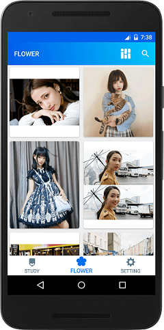
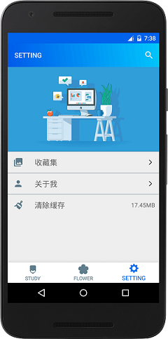
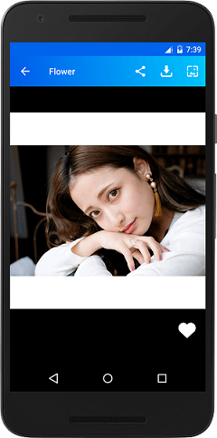
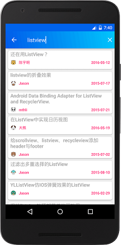

# AnyThing
a little thing 😁 😁 😁
## 这是什么
这是一个gank.io的客户端,仅仅选择了几个我个人感兴趣的标签显示,包含Android,IOS和前端内容,基本上遵循Google material设计,使用了MVP+Retrofit+Rxjava完成.
## 展示
      
## 你可以学到
- 项目整体使用mvp架构,遵循Google的[todo架构](https://github.com/googlesamples/android-architecture/tree/todo-mvp),能够了解mvp架构的设计思路,如何减少耦合.
- 网络:[Retrofit](https://github.com/square/retrofit) ,[OkHttp](https://github.com/square/okhttp),通过本App可以学习到Retrofit的应对各种api接口的强大,通过Okhttp进行网络可以轻松应对网络设置
- 通过本App可以学习强大的异步处理库[RxJava](https://github.com/ReactiveX/RxJava)
## 致谢
- 感谢[gank.io](http://gank.io)提供的接口数据
- 闪屏壁纸来源[爱壁纸](https://www.lovebizhi.com/)